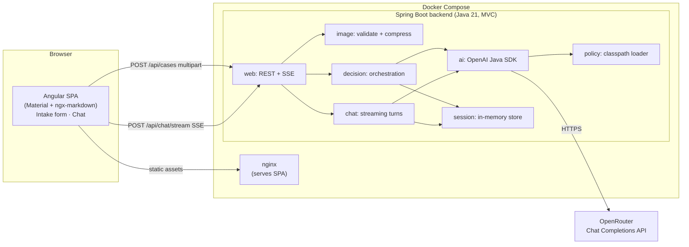
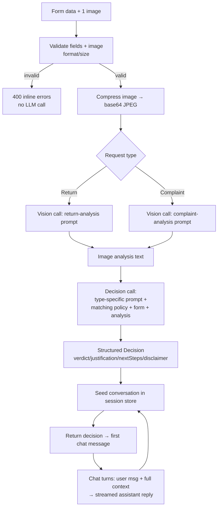

# ADR: Hardware Service Decision Copilot — Main Architecture

**Date:** 2026-06-24
**Status:** Accepted
**PRD:** [`docs/PRD-Product-Requirements-Document.md`](../PRD-Product-Requirements-Document.md)

---

## 1. Overview

The Hardware Service Decision Copilot is a responsive web application that gives a customer an
**advisory** recommendation (Approve / Reject / Needs review) on whether their electronics
**complaint** (*reklamacja*) or **return** (*zwrot*) is likely to be accepted. The customer fills
an intake form and uploads one photo; a multimodal LLM analyses the photo, a reasoning LLM
combines that analysis with the form data and the matching company policy, and the result is shown
as the first message of a chat the customer can continue.

This ADR defines the **overall system**: the component map, the technology stack, cross-cutting
data models, environment configuration, the main flows, and the project-wide testing strategy.
Per-area detail lives in the granular ADRs:

- [`001-backend-spring-boot.md`](001-backend-spring-boot.md) — Spring Boot backend (API, multipart, image compression, session store, SSE)
- [`002-ai-integration-openrouter.md`](002-ai-integration-openrouter.md) — LLM integration via the OpenAI Java SDK against OpenRouter
- [`003-frontend-angular.md`](003-frontend-angular.md) — Angular + Angular Material UI, chat, and SSE streaming

The MVP has **no authentication, no database, and no persistence** (see PRD §7). All state lives in
memory for the duration of a session.

---

## 2. Context7 Library References

Implementing agents should fetch docs via these handles. **Note:** Context7 was not reachable when
this ADR was written (the `CONTEXT7_API_KEY` in `.env.example` is a placeholder), so the handles
below are the expected identifiers and must be confirmed with `resolve-library-id` at implementation
time. Where Context7 is unavailable, use the official doc URLs listed.

| Library | Context7 Handle (confirm) | Used for | Official docs |
|---|---|---|---|
| Spring Boot | `/spring-projects/spring-boot` | Backend framework | https://docs.spring.io/spring-boot/ |
| OpenAI Java SDK | *(no confirmed handle)* | LLM calls to OpenRouter | https://github.com/openai/openai-java · https://developers.openai.com/api/reference/java |
| Thumbnailator | *(no confirmed handle)* | Server-side image compression | https://github.com/coobird/thumbnailator |
| TwelveMonkeys ImageIO | *(no confirmed handle)* | WebP decoding for ImageIO | https://github.com/haraldk/TwelveMonkeys |
| Angular | `/angular/angular` | Frontend framework | https://angular.dev |
| Angular Material | `/angular/components` | UI component library | https://material.angular.io |
| ngx-markdown | `/jfcere/ngx-markdown` | Render Markdown agent messages | https://github.com/jfcere/ngx-markdown |
| OpenRouter (API, not a lib) | n/a | LLM gateway | https://openrouter.ai/docs |

---

## 3. System Architecture

### Architecture pattern

**SPA + REST/SSE API**, deployed as two containers behind Docker Compose:

- **Frontend:** Angular single-page application served as static files by nginx.
- **Backend:** Spring Boot monolith exposing a small REST API plus one SSE streaming endpoint.
- **External:** OpenRouter LLM gateway (OpenAI-compatible Chat Completions API), reached with the
  OpenAI Java SDK.

The backend is a **stateless-per-request service with in-memory session state** (a conversation
store keyed by a client-generated session id). No database, no disk persistence.

### Repository structure

Monorepo with the application under `app/` (per `AGENTS.md`):

```
app/
  backend/                 Spring Boot + Maven service
    src/main/java/...       application code
    src/main/resources/
      application.yml
      policies/             return + complaint policy markdown (build-time copy of docs/policies)
    pom.xml
    Dockerfile
  frontend/                Angular + Angular Material SPA
    src/...
    package.json
    Dockerfile
    nginx.conf
  docker-compose.yml       orchestrates backend + frontend
docs/
  policies/                source of truth for the two policy documents
  ADR/                     this folder
```

The two policy markdown files in `docs/policies/` are the **source of truth**; they are copied into
`app/backend/src/main/resources/policies/` at build time so the backend can load them from the
classpath (works inside the fat JAR). See [`002`](002-ai-integration-openrouter.md) for loading.

### Technology stack

| Layer | Technology | Reason |
|---|---|---|
| Backend | Spring Boot 4.1.x (Spring Framework 7), Java 21 toolchain | Current GA; cleanly supports the installed JDK 25 (Boot 3.4 does not); Java 21 `--release` target + virtual threads make blocking LLM I/O cheap |
| Web layer | Spring MVC (`spring-boot-starter-web`) + `SseEmitter` | The OpenAI Java SDK is blocking/OkHttp-based; MVC + virtual threads fits it better than WebFlux |
| LLM client | OpenAI Java SDK `com.openai:openai-java` 4.41.x | Official SDK; supports custom base URL (OpenRouter), streaming, vision, structured outputs |
| LLM gateway | OpenRouter, **Chat Completions API** | Responses API is beta on OpenRouter with no documented streaming/vision/structured output |
| Image compression | Thumbnailator 0.4.x + TwelveMonkeys `imageio-webp` 3.13.x | Simple resize/recompress; TwelveMonkeys adds WebP read support to ImageIO |
| Frontend | Angular 20.x (standalone, signals, zoneless) | Latest stable; signals make incremental token rendering clean |
| UI components | Angular Material 20.x | Required by the brief; covers form controls; chat UI built on top |
| Markdown | ngx-markdown 18.x (+ `marked`) | Renders the formatted decision message and agent replies |
| SSE client | `@microsoft/fetch-event-source` | Allows SSE over POST with a request body and reconnection handling |
| Packaging | Docker + Docker Compose; nginx for the SPA | One-command local startup for the group |

---

## 4. Module Structure & Dependencies

### Backend modules (packages)

| Module | Responsibility | Depends on | Depended on by |
|---|---|---|---|
| `web` (controllers) | REST endpoints, multipart intake, SSE chat endpoint, error handling (`@ControllerAdvice`) | `decision`, `chat`, `image`, `session` | — |
| `image` | Validate (magic bytes + size) and compress the uploaded image to a base64 JPEG data URL | TwelveMonkeys, Thumbnailator | `web` |
| `ai` | OpenAI-SDK client config, prompt assembly, Chat Completions calls (analysis, decision, chat streaming) | OpenAI Java SDK, `policy` | `decision`, `chat` |
| `decision` | Orchestrates: image analysis → decision; produces the structured decision object | `ai`, `image`, `policy` | `web` |
| `chat` | Multi-turn chat turns with full context, streamed via SSE | `ai`, `session` | `web` |
| `session` | In-memory conversation store (`ConcurrentHashMap`), session lifecycle/eviction | — | `web`, `chat`, `decision` |
| `policy` | Loads the two policy markdown files from the classpath at startup | — | `ai`, `decision` |
| `config` | CORS, multipart limits, virtual-thread executor, SDK client bean | — | all |

**Dependency direction:** `web → {decision, chat} → ai → policy`; `session` and `image` are leaf
services. No circular dependencies.

### Frontend modules

| Module | Responsibility | Depends on | Depended on by |
|---|---|---|---|
| `IntakeFormComponent` | Reactive form, client-side validation, image preview, submit | `CaseApiService` | router |
| `ChatComponent` | Message list, input, typing indicator, incremental render | `ChatApiService`, `MessageBubbleComponent` | router |
| `MessageBubbleComponent` | One message; renders agent messages via ngx-markdown | ngx-markdown | `ChatComponent` |
| `CaseApiService` | POST intake → receive decision + session id | HttpClient | `IntakeFormComponent` |
| `ChatApiService` | Stream chat replies via SSE-over-POST | `@microsoft/fetch-event-source` | `ChatComponent` |
| `SessionState` | Holds session id + submitted-case summary across the two screens (signals) | — | both components |
| `pl` constants | All Polish user-facing strings, centralised | — | all components |

---

## 5. Data Models

Conceptual only; not persisted (in memory / in transit).

### CaseSubmission (intake request → backend)
- `requestType`: enum `COMPLAINT` | `RETURN` — required.
- `category`: enum from the predefined list (Smartfony, Laptopy, Tablety, Telewizory, Słuchawki,
  Smartwatche, Konsole do gier, Sprzęt audio, Aparaty fotograficzne, Akcesoria, Inne) — required.
- `model`: string (equipment name/model) — required.
- `purchaseDate`: date — required, must not be in the future.
- `reason`: string — required when `requestType=COMPLAINT`, optional when `RETURN`.
- `image`: one file (`JPEG`/`PNG`/`WebP`, ≤ 10 MB) — required.

### ImageAnalysis (LLM output, internal)
- `summary`: string — what the photo shows.
- For RETURN: `signsOfUse`, `resellable` assessments.
- For COMPLAINT: `damaged`, `damageType`, `likelyCause` assessments.
- `usable`: boolean — false when the photo is too blurry/insufficient.

### Decision (structured LLM output → first chat message)
- `verdict`: enum `APPROVE` | `REJECT` | `NEEDS_REVIEW` — exactly one.
- `justification`: string (Polish) referencing concrete factors (time since purchase, image
  findings, applicable policy rule).
- `nextSteps`: string (Polish).
- `disclaimer`: string (Polish) — advisory-only statement (always present).
- `missingInfo`: string (Polish) — populated only for `NEEDS_REVIEW`.

### ChatMessage (conversation turn, in memory)
- `role`: enum `SYSTEM` | `USER` | `ASSISTANT`.
- `content`: string.

### Conversation (in-memory session value)
- `sessionId`: string (client-generated UUID).
- `caseSummary`: request type, category, model, purchase date.
- `imageAnalysis`: the ImageAnalysis text.
- `messages`: ordered list of ChatMessage (seeded with system prompt + first decision message).
- `createdAt` / `lastActivityAt`: timestamps for TTL eviction.

---

## 6. API / Interface Contracts

Base path `/api`. All human-readable text in Polish. No auth.

### POST `/api/cases` — submit intake, get decision
- **Input:** `multipart/form-data` — fields of `CaseSubmission` + the image part.
- **Output (200):** `{ sessionId, decision: Decision, caseSummary }`. The backend has already
  seeded the conversation with the system prompt, image analysis, and the first decision message.
- **Errors:**
  - `400` — validation failure (missing field, future date, empty reason for complaint, wrong
    image type, image > 10 MB). Body: field-level error list. **No LLM call is made.**
  - `502/503` — LLM/analysis failure or timeout. Body: non-technical, retryable error. No decision
    fabricated.
- **Notes:** image is compressed before any LLM call; two LLM calls happen server-side (analysis
  then decision); decision call uses structured JSON output (non-streamed).

### POST `/api/chat/stream` — follow-up chat turn (streaming)
- **Input:** `{ sessionId, message }` (JSON). `Accept: text/event-stream`.
- **Output:** `text/event-stream` — assistant tokens streamed as SSE `data:` events; a terminal
  event signals completion. The new user message and the full assistant reply are appended to the
  in-memory conversation.
- **Errors:** if the session is unknown/expired → `404` (UI should offer to start a new case). If
  the LLM fails mid-turn → an SSE `error` event; prior messages remain intact (client shows a retry
  for that turn).
- **Notes:** the agent receives the full conversation context every turn (case data + image
  analysis + prior messages). Off-topic requests are politely declined (AC-27).

### GET `/api/health` — liveness
- **Output (200):** `{ status: "UP" }`. Used by Docker Compose healthcheck.

Full request/response shapes per area: [`001`](001-backend-spring-boot.md) (HTTP) and
[`002`](002-ai-integration-openrouter.md) (LLM prompts and structured schema).

---

## 7. Environment Variables

Sourced from `.env.example`. The OpenAI Java SDK also natively reads `OPENAI_API_KEY` /
`OPENAI_BASE_URL`; this project maps the OpenRouter values onto explicit config (see `001`).

| Variable | Purpose | Required | Example value |
|---|---|---|---|
| `OPENROUTER_API_KEY` | Bearer key for OpenRouter | Yes | `sk-or-v1-...` |
| `OPENROUTER_BASE_URL` | LLM gateway base URL | Yes | `https://openrouter.ai/api/v1` |
| `OPENROUTER_TEXT_MODEL` | Model slug for decision + chat | Yes | `openai/gpt-5.4-mini` |
| `OPENROUTER_VISION_MODEL` | Model slug for image analysis | Yes | `openai/gpt-5.4-mini` |
| `OPENROUTER_MODEL` | Fallback model when a split var is missing (dev only) | No | `openai/gpt-5.4-mini` |
| `OPENAI_API_KEY` | If set, used instead of `OPENROUTER_API_KEY` (per `.env.example` note) | No | — |
| `APP_HTTP_REFERER` | OpenRouter attribution header `HTTP-Referer` | No | `http://localhost:4200` |
| `APP_TITLE` | OpenRouter attribution header `X-Title` | No | `Hardware Service Copilot` |
| `CONTEXT7_API_KEY` | Docs-aware coding (dev tooling only) | No | `ctx7sk-...` |
| `PORT` / `SERVER_PORT` | Backend port | No | `8080` |
| `CORS_ALLOWED_ORIGIN` | Angular origin allowed by CORS | No | `http://localhost:4200` |

> **Model note:** the agents must pass the model as a **String** slug (e.g. `openai/gpt-5.4-mini`).
> The SDK's `ChatModel` enum only contains OpenAI's own slugs and must not be used against OpenRouter.

---

## 8. Technical Decisions

### Use OpenRouter Chat Completions API (not the Responses API)
**Status:** Accepted · **Date:** 2026-06-24
**Context:** OpenRouter exposes both a Chat Completions API and a beta Responses API. We must do
multimodal image analysis, streaming chat, and structured decision output.
**Decision:** Use the **Chat Completions API**. OpenRouter's Responses API is explicitly beta
("may have breaking changes — use with caution in production") and its docs do not cover streaming,
multimodal image input, or structured output. Chat Completions documents all three. The OpenAI Java
SDK also has a known type-system conflict combining streaming with structured outputs on the
Responses path (issue #495), which does not affect Chat Completions.
**Rejected alternatives:**
- *OpenRouter Responses API:* beta, missing documented streaming/vision/structured-output; SDK
  streaming+structured conflict.
- *Direct OpenAI API:* the project standardises on OpenRouter keys/models (`.env.example`).
- *Spring AI starter:* viable, but the brief specifies the OpenAI Java SDK; avoids an extra
  abstraction.
**Consequences:**
- (+) Stable, fully documented features today; no beta risk.
- (+) Both APIs are stateless anyway, so no capability is lost given no persistence.
- (−) Must migrate later if we want native Responses features (server tools, reasoning) — acceptable.
**Review trigger:** Revisit if OpenRouter marks the Responses API stable and the SDK resolves #495,
or if we need server-side reasoning/tool features.

### Spring MVC + SseEmitter + virtual threads (not WebFlux)
**Status:** Accepted · **Date:** 2026-06-24
**Context:** We need to stream LLM tokens to the browser. The OpenAI Java SDK is blocking/OkHttp.
**Decision:** Spring MVC with `SseEmitter`, running request work on Java 21 virtual threads
(`spring.threads.virtual.enabled=true`). The blocking SDK stream is forwarded chunk-by-chunk into
the emitter.
**Rejected alternatives:**
- *WebFlux:* the SDK still blocks underneath; bridging a blocking `Stream` into `Flux` adds
  complexity with no real concurrency gain at MVP scale.
**Consequences:** (+) Simple, proven, matches the SDK. (−) Manual emitter lifecycle/error handling.
**Review trigger:** If we adopt a fully reactive stack (R2DBC, reactive SDK), reconsider.

### In-memory conversation store, no persistence
**Status:** Accepted · **Date:** 2026-06-24
**Context:** PRD §7 forbids persistence in the MVP, but chat needs context across turns.
**Decision:** A `ConcurrentHashMap` conversation store keyed by a **client-generated** session UUID
(sent on each request), with TTL/idle eviction. No cookies, no `HttpSession`, no DB.
**Rejected alternatives:**
- *HttpSession:* couples to servlet session + `JSESSIONID` cookie; awkward for an SPA + SSE.
- *Stateless client-resends-history:* exposes the full system prompt/policy to the client and
  bloats requests (rejected in clarification with the user).
**Consequences:** (+) Simple, server-side, nothing persisted. (−) State lost on restart and not
shared across instances — acceptable for a single-instance MVP.
**Review trigger:** If we scale to multiple backend instances or add persistence.

### Two-call AI pipeline; structured decision, streamed chat
**Status:** Accepted · **Date:** 2026-06-24
**Context:** PRD §11 defines two roles (image analyst, decision agent) and requires a strict
3-value decision plus a continuing chat.
**Decision:** Call 1 = vision analysis (request-type-specific prompt). Call 2 = decision (reasoning,
request-type-specific prompt + injected matching policy + form + analysis) using **structured JSON
output** (verdict/justification/nextSteps/disclaimer). The first chat message is rendered from that
structured object. Subsequent chat turns are **streamed plain text** with full context.
**Rejected alternatives:**
- *Single combined call:* mixes vision and policy reasoning, harder to constrain to 3 outcomes.
- *Streaming the first decision:* streaming + structured output conflict in the SDK; the decision
  is short, so non-streamed is fine.
**Consequences:** (+) Clean separation, strict decision shape, good UX. (−) Two LLM calls per
submission (higher latency/cost) — acceptable for an MVP.
**Review trigger:** If latency/cost of two calls becomes a problem, or a single multimodal reasoning
model proves reliable for both.

### Docker Compose deployment
**Status:** Accepted · **Date:** 2026-06-24
**Context:** The group wants reproducible one-command startup.
**Decision:** Two services (backend, frontend-nginx) orchestrated by `docker-compose.yml`; secrets
via env file. Backend on `:8080`, frontend on `:4200`/`:80`.
**Rejected alternatives:** *Local-only manual run* (less reproducible); *cloud deploy* (out of scope
for the MVP).
**Consequences:** (+) Reproducible, portable. (−) Slightly more setup than bare local run.
**Review trigger:** When moving toward a hosted environment.

### Spring Boot 4.1.x on a Java 21 toolchain (dev JDK 25)
**Status:** Accepted · **Date:** 2026-06-24
**Context:** The scaffold was generated by Spring Initializr, whose current default is **Spring Boot
4.1.0** (Spring Framework 7). The development machine runs **JDK 25**. Spring Boot 3.4.x officially
supports only JDK 17–23, so it is not a supported runtime on the installed JDK.
**Decision:** Adopt **Spring Boot 4.1.x**, compiling to a **Java 21** release target
(`<java.version>21</java.version>`, `--release 21`) so the bytecode floor stays at the Java 21 LTS
while running on the installed JDK 25. Boot 4 renames the web starter to `spring-boot-starter-webmvc`
(used in the pom). The blocking-SDK + MVC + virtual-threads design is unchanged (Spring MVC and
`SseEmitter` exist in Spring Framework 7).
**Rejected alternatives:**
- *Spring Boot 3.4.x + JDK 21:* would require installing JDK 21 (not present); 3.4 is unsupported on
  the installed JDK 25.
- *Spring Boot 3.4.x on JDK 25:* unsupported combination; risk of bytecode/agent issues.
**Consequences:** (+) Matches the installed JDK and the Initializr default; current GA. (−) Boot 4 is
new — third-party Spring add-ons may lag (the LLM/image libs here are Spring-independent, so
unaffected); starter names differ from most online 3.x tutorials.
**Review trigger:** If the group standardises on JDK 21 and prefers the more battle-tested Boot 3.4,
or if a required Spring add-on lacks a Boot 4 release.

---

## 9. Diagrams

### 9.1 Architecture / Component Diagram



### 9.2 Data Flow Diagram



### 9.3 Sequence Diagrams

#### Intake submission → decision (happy path)
```mermaid
sequenceDiagram
    participant U as Customer
    participant FE as Angular SPA
    participant BE as Spring Boot
    participant OR as OpenRouter

    U->>FE: Fill form + choose image
    FE->>FE: Client-side validation (type/size/required)
    FE->>BE: POST /api/cases (multipart) + sessionId(UUID)
    BE->>BE: Server validation (magic bytes, size, future date, reason)
    alt invalid
        BE-->>FE: 400 field errors (no LLM call)
    else valid
        BE->>BE: Compress image → base64 JPEG
        BE->>OR: Chat Completions (vision, analysis prompt)
        OR-->>BE: Image analysis text
        BE->>OR: Chat Completions (decision prompt + policy, structured JSON)
        OR-->>BE: Decision {verdict, justification, nextSteps, disclaimer}
        BE->>BE: Seed conversation (system + analysis + decision) in session store
        BE-->>FE: 200 {sessionId, decision, caseSummary}
        FE->>U: Navigate to chat; render decision as first message
    end
```

#### Streaming chat turn
```mermaid
sequenceDiagram
    participant U as Customer
    participant FE as Angular SPA
    participant BE as Spring Boot
    participant OR as OpenRouter

    U->>FE: Type follow-up, send
    FE->>BE: POST /api/chat/stream {sessionId, message} (Accept: text/event-stream)
    BE->>BE: Load conversation; append user message
    BE->>OR: Chat Completions (full context, stream=true)
    loop tokens
        OR-->>BE: chunk (delta)
        BE-->>FE: SSE data: token
        FE->>U: Append token to assistant bubble (signal)
    end
    BE->>BE: Append full assistant reply to conversation
    BE-->>FE: SSE complete event
```

#### Error — AI service unavailable
```mermaid
sequenceDiagram
    participant FE as Angular SPA
    participant BE as Spring Boot
    participant OR as OpenRouter

    FE->>BE: POST /api/cases (valid)
    BE->>OR: Chat Completions (vision)
    OR-->>BE: timeout / 5xx / mid-stream error event
    BE->>BE: No decision fabricated
    BE-->>FE: 502/503 retryable, non-technical message
    FE->>FE: Show retryable error state; form data preserved
```

---

## 10. Testing Strategy

### Philosophy
TDD per `AGENTS.md`: write tests from the spec (PRD ACs) before production code, confirm they fail
for the right reason, implement the minimum to pass, then refactor green. Every AC maps to at least
one automated test. The LLM is mocked everywhere except E2E.

### Test layers

| Layer | Type | Scope | Tools |
|---|---|---|---|
| Unit | All deps mocked | Validation rules, image compression, prompt assembly, decision mapping, session store, Polish-string presence | JUnit 5, Mockito, AssertJ (backend); Jasmine/Karma or Jest (frontend) |
| Integration | Only the external LLM API mocked | Controllers + multipart + SSE wiring; the OpenAI SDK pointed at a stub/WireMock OpenRouter | Spring Boot Test, MockMvc, WireMock |
| E2E | Nothing mocked (real stack) | Full intake → decision → chat against a running backend + frontend (real OpenRouter, cheap model) | Playwright (qa-engineer) |

### Key test scenarios

- **Valid return → Approve:** within 14 days, unused image → `APPROVE` with justification + steps +
  disclaimer. Edge: exactly day 14 vs day 15.
- **Valid complaint → Reject:** cracked-screen image, mechanical damage → `REJECT` with alternative
  (paid repair). Edge: ambiguous defect vs user damage.
- **Ambiguous → Needs review:** blurry/unusable image → `NEEDS_REVIEW` listing what is missing.
- **Invalid submission:** missing field / future date / empty reason on complaint / wrong format /
  > 10 MB → `400`, **no LLM call** (assert the SDK is never invoked). Edge: exactly 10 MB vs 10 MB+1.
- **AI unavailable:** SDK error/timeout → retryable error, no fabricated decision.
- **Chat context:** follow-up reply reflects form data + image analysis + new info added in chat.
- **Off-topic:** unrelated question → polite decline + redirect.
- **Streaming:** SSE emits multiple token events then completes; mid-stream error surfaces as an SSE
  error without losing prior messages.
- **Polish text:** all user-facing strings (errors, labels, decision) are Polish.

### Technical acceptance criteria

- **TAC-01:** No outbound LLM call occurs when server-side validation fails (verified by a never-called mock).
- **TAC-02:** Uploaded images are compressed (output bytes < input for a >1 MB test image) and converted to JPEG base64 before any LLM call.
- **TAC-03:** WebP, PNG, and JPEG inputs are all accepted and decoded (TwelveMonkeys registered).
- **TAC-04:** The decision object always contains exactly one of `APPROVE`/`REJECT`/`NEEDS_REVIEW`, a non-empty justification, and a non-empty advisory disclaimer.
- **TAC-05:** The vision and decision prompts differ by request type (assert prompt selection).
- **TAC-06:** The matching policy (return vs complaint) is injected into the decision prompt.
- **TAC-07:** `/api/chat/stream` returns `Content-Type: text/event-stream` and emits ≥1 `data:` event for a normal reply.
- **TAC-08:** Each chat turn sends the full conversation context to the LLM (assert message count/content in the mock).
- **TAC-09:** An unknown/expired `sessionId` on chat yields `404`, not a 500.
- **TAC-10:** CORS allows the configured Angular origin for `/api/**`.
- **TAC-11:** The model slug sent to OpenRouter equals the configured env value (e.g. `openai/gpt-5.4-mini`), passed as a String.
- **TAC-12:** Multipart rejects > 10 MB before analysis (assert `400`/`413`, no LLM call).
