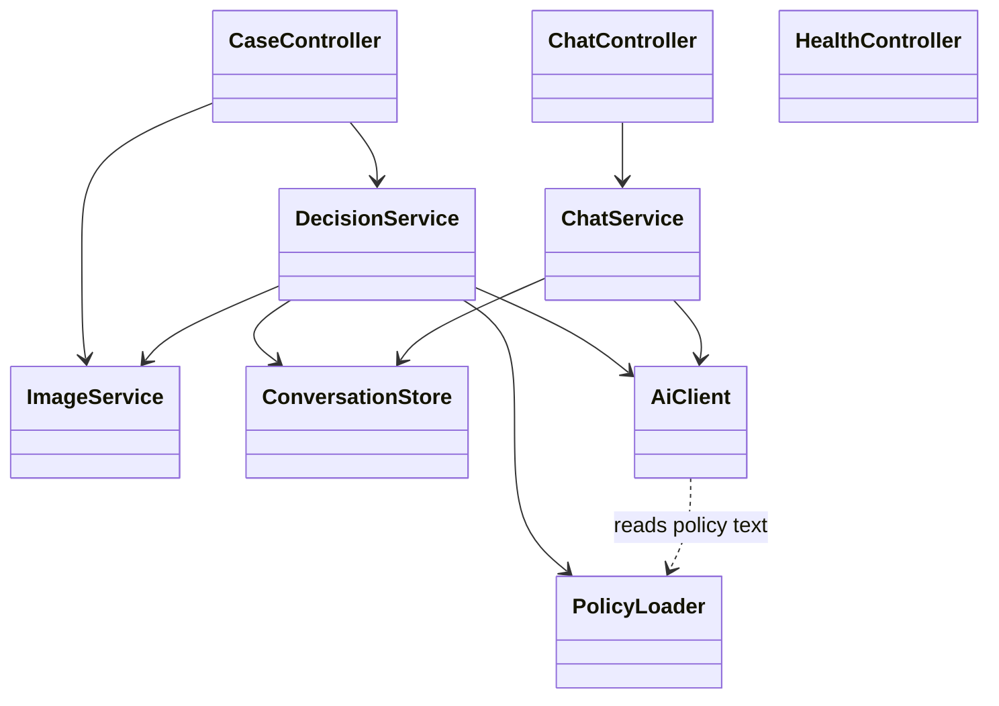
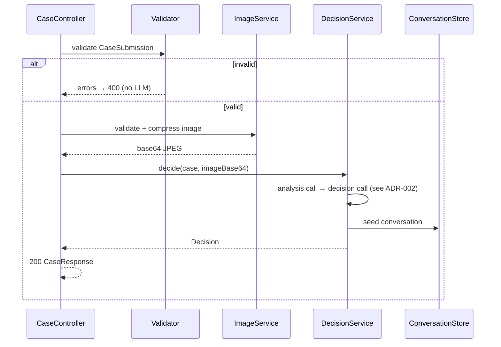

# ADR-001: Backend — Spring Boot Service

**Date:** 2026-06-24
**Status:** Accepted
**Relates to:** [`000-main-architecture.md`](000-main-architecture.md)

---

## 1. Scope

The Spring Boot backend: HTTP API (intake + chat SSE + health), multipart upload handling,
server-side validation, image compression, in-memory conversation store, CORS, error handling, and
the runtime wiring of the AI layer.

**Out of scope here:** the LLM prompts, the OpenAI-SDK call shapes, and structured-output schema →
[`002-ai-integration-openrouter.md`](002-ai-integration-openrouter.md). The Angular client →
[`003-frontend-angular.md`](003-frontend-angular.md).

---

## 2. Context7 References

| Library | Context7 Handle (confirm) | Used for | Official docs |
|---|---|---|---|
| Spring Boot | `/spring-projects/spring-boot` | Web, validation, config | https://docs.spring.io/spring-boot/ |
| Thumbnailator | *(confirm)* | Resize/recompress image | https://github.com/coobird/thumbnailator |
| TwelveMonkeys ImageIO | *(confirm)* | WebP decode for ImageIO | https://github.com/haraldk/TwelveMonkeys |

---

## 3. Component Design

Layered MVC. Controllers are thin; orchestration sits in services.

- **`CaseController`** — `POST /api/cases` (multipart). Binds `CaseSubmission`, runs validation,
  delegates to `DecisionService`, returns the decision + session id. Translates failures to the
  error contract via `@ControllerAdvice`.
- **`ChatController`** — `POST /api/chat/stream`. Returns an `SseEmitter`; hands work to
  `ChatService` on a **virtual-thread executor**.
- **`HealthController`** — `GET /api/health`.
- **`ImageService`** — validates (magic-byte sniffing + declared content-type allowlist + size) and
  compresses to a base64 JPEG data URL (Thumbnailator; max dimension ~1024 px; quality ~0.85). Reads
  WebP via the TwelveMonkeys ImageIO SPI plugin.
- **`DecisionService`** — orchestrates the two LLM calls (analysis → decision), seeds the
  conversation, returns the `Decision`. (LLM specifics in `002`.)
- **`ChatService`** — appends the user message, calls the streaming LLM, forwards tokens to the
  `SseEmitter`, appends the final assistant message to the conversation.
- **`ConversationStore`** — `@Component` wrapping a `ConcurrentHashMap<String, Conversation>` with
  idle-TTL eviction (scheduled sweep). The session id is **client-generated** and passed per request.
- **`PolicyLoader`** — loads `classpath:policies/*.md` once at startup (`@PostConstruct` /
  `ApplicationRunner`) via `ResourcePatternResolver`; exposes return + complaint policy text.
- **Config:** `CorsConfig` (`WebMvcConfigurer`), multipart limits (`application.yml`), virtual-thread
  executor bean, OpenAI SDK client bean (in `002`).

### State management
Only `ConversationStore` holds state — in memory, keyed by session id, evicted on idle timeout
(default 30 min) and bounded by a max-entries cap. Lost on restart (acceptable per PRD §7).

---

## 4. Data Structures

- **`CaseSubmission`** (multipart form binding): `requestType` (enum), `category` (enum), `model`
  (string), `purchaseDate` (ISO date), `reason` (string, conditionally required), `image`
  (`MultipartFile`).
- **`CaseResponse`**: `sessionId`, `decision` (see `002`), `caseSummary`.
- **`CaseSummary`**: `requestType`, `category`, `model`, `purchaseDate`.
- **`ChatRequest`**: `sessionId`, `message`.
- **`ChatMessage`** (record): `role` (`SYSTEM`/`USER`/`ASSISTANT`), `content`.
- **`Conversation`**: `sessionId`, `caseSummary`, `imageAnalysis`, `messages` (ordered),
  `createdAt`, `lastActivityAt`.
- **`ApiError`**: `code`, `message` (Polish), `fieldErrors[]` (`{field, message}`).

### Validation rules (server-side, authoritative)
| Rule | Source AC | Enforcement |
|---|---|---|
| `requestType` ∈ {COMPLAINT, RETURN} | AC-01 | bean validation enum |
| `category` from predefined list | AC-02 | enum binding |
| `model` non-blank | AC-03 | `@NotBlank` |
| `purchaseDate` not in future | AC-04 | `@PastOrPresent` |
| `reason` required iff COMPLAINT | AC-05 | class-level `@AssertTrue` / group validation |
| exactly one image present | AC-06 | null/empty check |
| type ∈ {JPEG, PNG, WebP} | AC-07 | content-type allowlist **+ magic-byte sniff** |
| size ≤ 10 MB | AC-08 | multipart limit + explicit check |
| no LLM call until valid | AC-09 | validate before service delegation |

Magic bytes: JPEG `FF D8 FF`; PNG `89 50 4E 47`; WebP `52 49 46 46 …. 57 45 42 50` (RIFF…WEBP).

---

## 5. Interface Contracts

### POST `/api/cases`
- **Consumes:** `multipart/form-data`. **Produces:** `application/json`.
- **200:** `CaseResponse`.
- **400:** `ApiError` with `fieldErrors` (validation). No LLM call.
- **413/400:** payload over the multipart limit (`MaxUploadSizeExceededException`).
- **502/503:** `ApiError` (LLM failure/timeout), retryable, no fabricated decision.

### POST `/api/chat/stream`
- **Consumes:** `application/json` (`ChatRequest`). **Produces:** `text/event-stream`.
- **200:** SSE stream of `data:` token events, terminated by a `complete` event.
- **404:** unknown/expired session.
- **SSE `error` event:** mid-stream LLM failure (client retries that turn).

### GET `/api/health`
- **200:** `{ "status": "UP" }`.

### Maven / build (decisions)
- Parent: `spring-boot-starter-parent` 4.1.x. Java 21 (`<java.version>21</java.version>`, `--release 21`; dev JDK is 25).
  **Boot 4 starter naming:** `spring-boot-starter-webmvc` (not `-web`); test starters
  `spring-boot-starter-webmvc-test` + `spring-boot-starter-validation-test`.
- Dependencies: `spring-boot-starter-web`, `spring-boot-starter-validation`,
  `com.openai:openai-java` 4.41.x, `net.coobird:thumbnailator` 0.4.x,
  `com.twelvemonkeys.imageio:imageio-webp` 3.13.x (+ `imageio-core`), `spring-boot-starter-test`,
  WireMock for integration tests.
- `application.yml`: `spring.threads.virtual.enabled=true`;
  `spring.servlet.multipart.max-file-size=10MB`, `max-request-size=12MB`;
  `server.tomcat.max-http-form-post-size=12MB`; LLM + CORS config from env (see `000` §7).

---

## 6. Technical Decisions

### Magic-byte image validation in addition to content-type
**Status:** Accepted · **Date:** 2026-06-24
**Context:** The declared `Content-Type` of a `MultipartFile` is client-supplied and spoofable; AC-07
requires only JPEG/PNG/WebP.
**Decision:** Validate both the declared content-type allowlist **and** the leading magic bytes.
**Rejected alternatives:** *Content-type only* — spoofable, could pass a non-image to the compressor.
**Consequences:** (+) Robust rejection of bad uploads before any LLM cost. (−) A few bytes read per
request — negligible.
**Review trigger:** If we accept additional formats or move validation to a gateway.

### Compress + normalise to JPEG before analysis
**Status:** Accepted · **Date:** 2026-06-24
**Context:** AC-10 requires backend compression; vision calls are cheaper/faster on smaller images;
WebP write support in Java is awkward.
**Decision:** Resize to a max dimension (~1024 px), recompress at ~0.85 quality, and output **JPEG**
base64 regardless of input format. WebP/PNG inputs are decoded (TwelveMonkeys) then re-encoded JPEG.
**Rejected alternatives:** *Preserve original format* — needs WebP write plugin and sends larger
payloads. *No compression* — violates AC-10, higher cost/latency.
**Consequences:** (+) One consistent payload format, smaller, cheaper. (−) Slight quality loss
(acceptable for analysis).
**Review trigger:** If image fidelity materially affects analysis quality.

### Virtual-thread executor for SSE work
**Status:** Accepted · **Date:** 2026-06-24
**Context:** `SseEmitter` work must run off the request thread; the SDK call blocks.
**Decision:** Run emitter work on `Executors.newVirtualThreadPerTaskExecutor()`.
**Rejected alternatives:** *Fixed platform-thread pool* — caps concurrency, wastes threads on
blocking I/O.
**Consequences:** (+) Cheap blocking I/O, simple code. (−) Requires Java 21.
**Review trigger:** If moving below Java 21 or to a reactive client.

---

## 7. Diagrams

### Component / Class Diagram


### Sequence — multipart intake (server internals)


### Sequence — SSE chat (emitter lifecycle)
```mermaid
sequenceDiagram
    participant CC as ChatController
    participant EX as VirtualThreadExecutor
    participant CS as ChatService
    participant S as ConversationStore

    CC->>S: lookup sessionId
    alt missing
        CC-->>CC: 404
    else found
        CC->>EX: submit stream task; return SseEmitter
        EX->>CS: stream(conversation, userMessage)
        loop tokens
            CS-->>CC: emitter.send(token)
        end
        CS->>S: append assistant message
        CS-->>CC: emitter.complete()
    end
```

---

## 8. Testing Strategy

### Test scenarios for this area

| Scenario | Type | Input | Expected output | Edge cases |
|---|---|---|---|---|
| Field validation | Unit | Missing model / future date / empty complaint reason | `400` field errors; LLM mock never called | day 14 vs 15; reason present for return |
| Image type sniff | Unit | `.png` renamed to `.jpg`; real WebP/PNG/JPEG | Accept genuine images; reject spoofed/non-image | zero-byte file |
| Size limit | Integration | 10 MB and 10 MB + 1 | accept / reject (`400`/`413`) before analysis | exactly at limit |
| Compression | Unit | 4 MB JPEG, 3 MB PNG, 2 MB WebP | smaller JPEG base64 out; all decode | very small image (no upscale) |
| Intake happy path | Integration | Valid form + image, LLM stubbed (WireMock) | `200` `CaseResponse`; conversation seeded | — |
| LLM failure | Integration | WireMock returns 500/timeout | `502/503` retryable; no decision; no seed | mid-stream error |
| Chat stream | Integration | Known session + message | `text/event-stream`; ≥1 `data:`; `complete` | empty message rejected |
| Unknown session | Unit | Random sessionId | `404` | expired/evicted session |
| Conversation context | Unit | Two turns | 2nd LLM call includes full prior context | new info incorporated |
| CORS | Integration | Preflight from `http://localhost:4200` | allowed for `/api/**` | other origin blocked |
| Policy loading | Unit | Startup | both policy files loaded, non-empty | missing file fails fast |

### Technical acceptance criteria

- **TAC-001-01:** Validation failures return `400` with field-level Polish messages and **zero** LLM invocations.
- **TAC-001-02:** Spoofed/non-image content is rejected by magic-byte check even with an allowed declared content-type.
- **TAC-001-03:** Compressed output is JPEG base64 and strictly smaller than a >1 MB input for all three input formats.
- **TAC-001-04:** Uploads > 10 MB are rejected before any analysis call.
- **TAC-001-05:** `/api/chat/stream` produces `text/event-stream` and a terminal completion event.
- **TAC-001-06:** Unknown/expired session on chat → `404`.
- **TAC-001-07:** Conversation store evicts entries after the configured idle TTL.
- **TAC-001-08:** CORS permits the configured origin and rejects others for `/api/**`.
- **TAC-001-09:** Startup fails fast if a required policy file is missing from the classpath.
