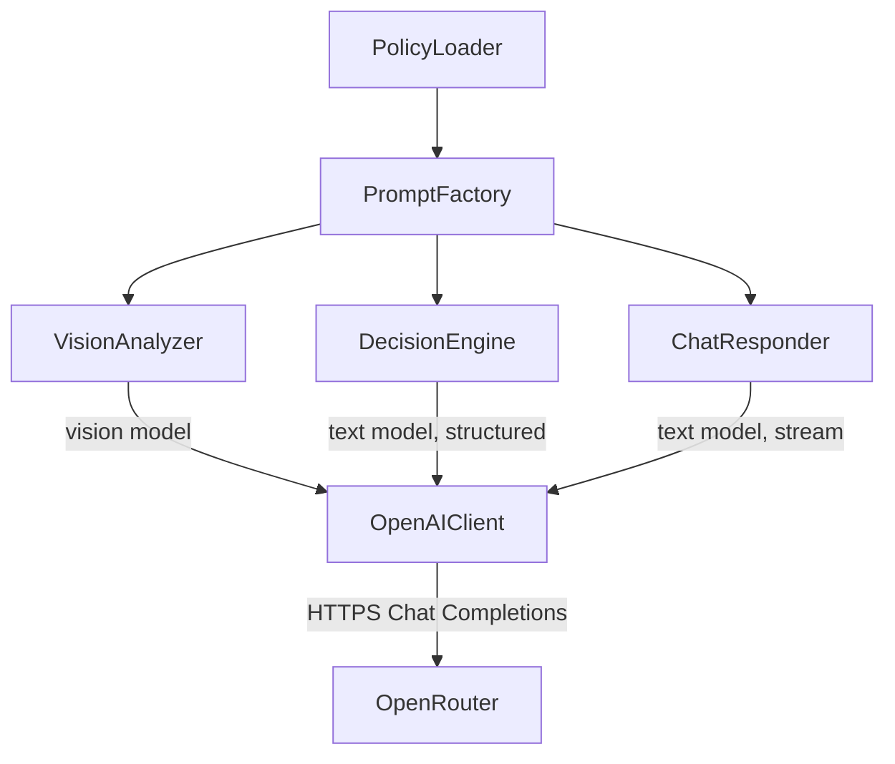
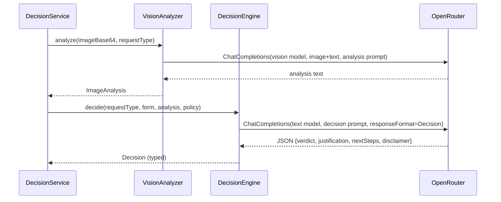
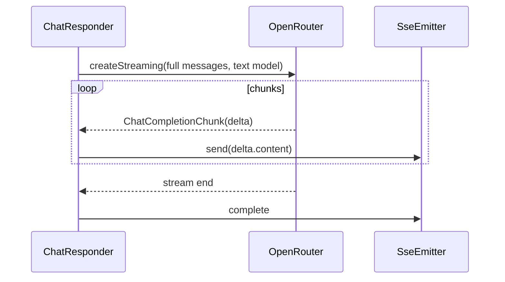

# ADR-002: AI Integration — OpenAI Java SDK against OpenRouter

**Date:** 2026-06-24
**Status:** Accepted
**Relates to:** [`000-main-architecture.md`](000-main-architecture.md)

---

## 1. Scope

How the backend talks to LLMs: SDK choice and client configuration, the API (Chat Completions vs
Responses), the four prompts, multimodal image input, structured decision output, streaming chat,
policy injection, model selection, and OpenRouter-specific gotchas.

**Out of scope here:** HTTP endpoints, multipart, image compression → [`001`](001-backend-spring-boot.md).
The UI → [`003`](003-frontend-angular.md).

---

## 2. Context7 References

| Library | Context7 Handle (confirm) | Used for | Official docs |
|---|---|---|---|
| OpenAI Java SDK | *(no confirmed handle — Context7 unavailable)* | All LLM calls | https://github.com/openai/openai-java · https://developers.openai.com/api/reference/java |
| OpenRouter API | n/a (HTTP service) | LLM gateway | https://openrouter.ai/docs |

Key facts captured from research (2026-06-24):
- `com.openai:openai-java` latest stable **4.41.x**; Jackson-based; built by Stainless.
- OpenRouter Chat Completions: `POST https://openrouter.ai/api/v1/chat/completions`. Responses API
  (`/responses`) is **beta** — not used (see decision below).
- OpenRouter recommends attribution headers `HTTP-Referer` and `X-Title` (optional for function).

---

## 3. Component Design

- **`AiClientConfig`** — builds one `OpenAIClient` bean via `OpenAIOkHttpClient.builder()` with
  `.apiKey(OPENROUTER_API_KEY)`, `.baseUrl(OPENROUTER_BASE_URL)`, and
  `.putAdditionalHeader("HTTP-Referer", …)` / `.putAdditionalHeader("X-Title", …)`. If
  `OPENAI_API_KEY` is set it takes precedence (per `.env.example`).
- **`PromptFactory`** — assembles the four prompts (system + user content) from templates, request
  type, form data, image-analysis text, and the injected policy. All prompt text is **Polish**.
- **`VisionAnalyzer`** — one Chat Completions call with a multi-part user message (image data URL +
  instruction); returns the analysis text. Uses `OPENROUTER_VISION_MODEL`.
- **`DecisionEngine`** — one Chat Completions call with **structured output** (a `Decision` POJO);
  returns the typed decision. Uses `OPENROUTER_TEXT_MODEL`.
- **`ChatResponder`** — streaming Chat Completions call (`createStreaming`) over the full
  conversation; forwards token deltas. Uses `OPENROUTER_TEXT_MODEL`.

### The four prompts (PRD §11, AC-11..AC-17)
| Prompt | Model var | Purpose |
|---|---|---|
| `return-analysis` | vision | Judge whether the item shows no signs of use and is resellable |
| `complaint-analysis` | vision | Judge whether damaged, the damage type, the likely cause |
| `return-decision` | text | Decide using return policy + form + analysis |
| `complaint-decision` | text | Decide using complaint policy + form + analysis |

Each prompt encodes the §11.2/§11.3 guardrails: advisory-only, no binding guarantee, no invented
rules/prices/deadlines, no legal advice beyond policy, no sensitive-data requests, off-topic
redirect, and the mandatory Polish disclaimer.

---

## 4. Data Structures

- **`ImageAnalysis`** (text returned by `VisionAnalyzer`): free-form Polish summary plus the
  type-specific assessments (used as context, not shown raw to the user).
- **`Decision`** (structured output schema — POJO with `@JsonPropertyDescription` per field):
  - `verdict`: enum `APPROVE` | `REJECT` | `NEEDS_REVIEW`.
  - `justification`: string (Polish), references concrete factors.
  - `nextSteps`: string (Polish).
  - `disclaimer`: string (Polish), advisory statement (always present).
  - `missingInfo`: string (Polish), only for `NEEDS_REVIEW`.
- **Chat request messages:** the in-memory `Conversation.messages` mapped to SDK
  `ChatCompletionMessageParam`s (system, user, assistant), sent **in full** every turn.

---

## 5. Interface Contracts (SDK-level, conceptual)

- **Vision analysis:** `client.chat().completions().create(params)` where `params` use the vision
  model slug (String) and a user message built from `ChatCompletionContentPart.ofImageUrl(...)`
  (data URL `data:image/jpeg;base64,…`) + `ChatCompletionContentPart.ofText(...)`. Returns the
  assistant text.
- **Decision:** `client.chat().completions().create(structuredParams)` where `structuredParams` are
  `ChatCompletionCreateParams.builder()....responseFormat(Decision.class)` →
  `StructuredChatCompletionCreateParams<Decision>`. Returns a deserialized `Decision`.
- **Chat streaming:** `client.chat().completions().createStreaming(params)` →
  `StreamResponse<ChatCompletionChunk>`; iterate deltas in try-with-resources, forward
  `choice.delta().content()` to the SSE emitter; close the stream on completion/error.

> No raw Java implementation here by ADR convention — the implementing agent uses the SDK docs.
> The above names the exact SDK entry points to use.

---

## 6. Technical Decisions

### OpenAI Java SDK + Chat Completions against OpenRouter
**Status:** Accepted · **Date:** 2026-06-24
**Context:** Brief mandates the OpenAI Java SDK and OpenRouter. We need vision, structured output,
and streaming.
**Decision:** Use `com.openai:openai-java` 4.41.x configured with OpenRouter base URL + key, on the
**Chat Completions** API. Chat Completions documents and supports all three needs; OpenRouter's
Responses API is beta and the SDK has a streaming+structured-output conflict on the Responses path
(issue #495).
**Rejected alternatives:**
- *Responses API:* beta on OpenRouter; missing documented streaming/vision/structured output; SDK #495.
- *Spring AI `ChatClient`:* clean abstraction with `base-url` override, but the brief specifies the
  OpenAI Java SDK; one less abstraction to reason about.
- *Hand-rolled HTTP client:* re-implements streaming/JSON-schema plumbing the SDK already provides.
**Consequences:** (+) Stable, typed, supports vision/structured/streaming now. (−) Some SDK types
(e.g. `ChatModel` enum) are OpenAI-specific and unusable with OpenRouter slugs (see gotchas).
**Review trigger:** OpenRouter Responses API leaves beta **and** SDK #495 is fixed.

### Structured output for the decision; streamed plain text for chat
**Status:** Accepted · **Date:** 2026-06-24
**Context:** The decision must be exactly one of three values with justification; chat should feel
live. The SDK cannot combine streaming with structured output cleanly.
**Decision:** The decision call uses `responseFormat(Decision.class)` (non-streamed). Follow-up chat
turns stream plain text token-by-token.
**Rejected alternatives:** *Stream the decision* — blocked by SDK #495 and unnecessary (decision is
short). *Parse free-text decision* — fragile, risks invalid verdict values.
**Consequences:** (+) Guaranteed valid verdict shape; good chat UX. (−) Decision arrives all at once
(a brief spinner covers it).
**Review trigger:** If structured streaming becomes reliable in the SDK.

### Pass the model as a String slug; never the `ChatModel` enum
**Status:** Accepted · **Date:** 2026-06-24
**Context:** OpenRouter uses slugs like `openai/gpt-5.4-mini`; the SDK's `ChatModel` enum holds only
OpenAI's own slugs.
**Decision:** Read the model from env (`OPENROUTER_TEXT_MODEL`, `OPENROUTER_VISION_MODEL`) and pass
it as a String to `.model(String)`.
**Rejected alternatives:** *Use `ChatModel` enum* — wrong/absent slugs for OpenRouter.
**Consequences:** (+) Any OpenRouter-routable model works via config. (−) No compile-time model
validation — covered by a config test (TAC-11).
**Review trigger:** If the SDK adds first-class custom-slug support.

### Set OpenRouter attribution headers
**Status:** Accepted · **Date:** 2026-06-24
**Context:** OpenRouter recommends `HTTP-Referer` and `X-Title` for app attribution; not settable via
env in the SDK.
**Decision:** Set both via `putAdditionalHeader` from `APP_HTTP_REFERER` / `APP_TITLE`.
**Consequences:** (+) Proper attribution; harmless if omitted. (−) Must be set in code, not env-auto.
**Review trigger:** If OpenRouter changes header names (community uses `X-Title`; confirm current).

---

## 7. Diagrams

### Component diagram

### Sequence — analysis → structured decision

### Sequence — streaming chat turn

---

## 8. Testing Strategy

The LLM is **mocked** in unit/integration tests (WireMock simulating OpenRouter responses, including
streaming chunks and error events). Real OpenRouter is exercised only in qa-engineer E2E.

### Test scenarios for this area

| Scenario | Type | Input | Expected output | Edge cases |
|---|---|---|---|---|
| Prompt selection | Unit | requestType = return / complaint | correct analysis + decision prompt chosen | — |
| Policy injection | Unit | return vs complaint | matching policy text present in decision prompt | both policies non-empty |
| Vision request shape | Unit | image base64 + instruction | user message has image part + text part; vision model slug | https URL vs data URL |
| Structured decode | Integration | WireMock JSON with each verdict | `Decision` deserialized; verdict enum correct | unknown enum → handled error |
| Decision invariants | Unit | any decision | exactly one verdict; non-empty justification + disclaimer | NEEDS_REVIEW has missingInfo |
| Streaming forward | Integration | WireMock SSE chunks | tokens forwarded in order; completion emitted | mid-stream `error` event surfaced |
| Model slug | Unit | configured env model | request body `model` equals env String slug | split vs fallback var |
| Attribution headers | Unit | configured referer/title | `HTTP-Referer` + `X-Title` present | absent config → omitted, no error |
| Guardrails | Integration (mock) | off-topic prompt input | reply declines + redirects (prompt enforces) | sensitive-data request refused |

### Technical acceptance criteria

- **TAC-002-01:** Analysis and decision prompts are selected by request type (return vs complaint).
- **TAC-002-02:** The decision prompt contains the matching policy document text.
- **TAC-002-03:** The vision request carries an image content part with a `data:image/jpeg;base64,…` URL and the vision model slug.
- **TAC-002-04:** The decision response is parsed into a `Decision` with a valid `verdict` enum and a non-empty advisory `disclaimer`.
- **TAC-002-05:** A `NEEDS_REVIEW` decision includes non-empty `missingInfo`.
- **TAC-002-06:** Streaming forwards token deltas in arrival order and emits a completion signal.
- **TAC-002-07:** A simulated mid-stream OpenRouter `error` event is surfaced (no fabricated content, prior tokens kept).
- **TAC-002-08:** The outbound `model` field equals the configured env slug (String), and `ChatModel` enum is not used.
- **TAC-002-09:** Attribution headers are sent when configured and safely omitted otherwise.
