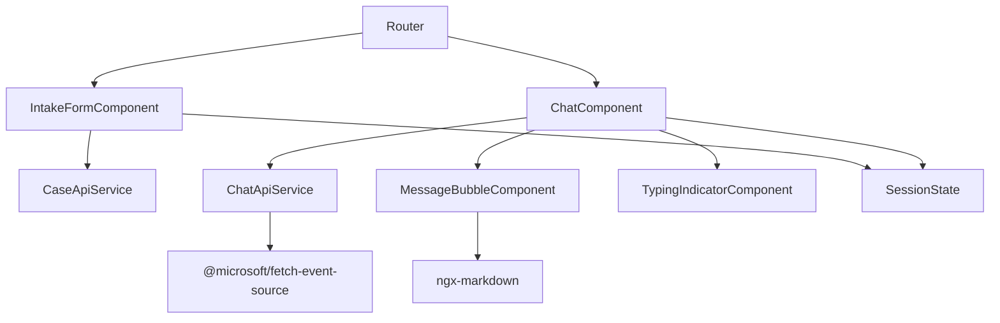
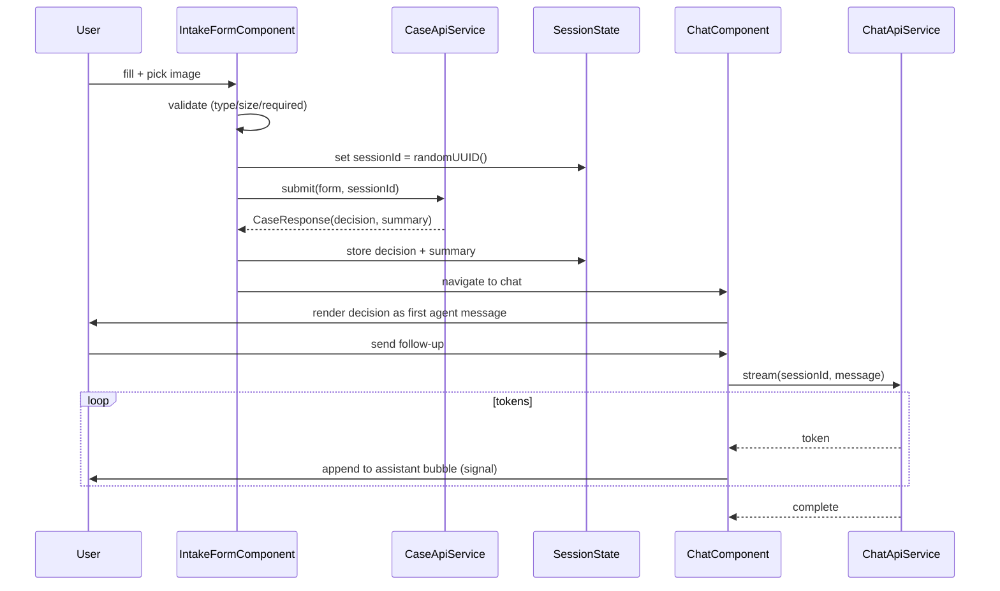

# ADR-003: Frontend — Angular + Angular Material

**Date:** 2026-06-24
**Status:** Accepted
**Relates to:** [`000-main-architecture.md`](000-main-architecture.md)

---

## 1. Scope

The Angular single-page app: the two screens (intake form, chat), client-side validation and image
preview, SSE token streaming, Markdown rendering of agent messages, cross-screen session state, and
Polish localisation. Visual styling follows the NBP design system in
[`docs/design-guidelines.md`](../design-guidelines.md) and `assets/design-tokens.json`.

**Out of scope here:** backend API internals → [`001`](001-backend-spring-boot.md); LLM behaviour →
[`002`](002-ai-integration-openrouter.md).

---

## 2. Context7 References

| Library | Context7 Handle (confirm) | Used for | Official docs |
|---|---|---|---|
| Angular | `/angular/angular` | SPA framework | https://angular.dev |
| Angular Material | `/angular/components` | Form controls, layout, theming | https://material.angular.io |
| ngx-markdown | `/jfcere/ngx-markdown` | Render agent Markdown | https://github.com/jfcere/ngx-markdown |
| @microsoft/fetch-event-source | *(npm, no handle)* | SSE over POST | https://github.com/Azure/fetch-event-source |

Versions (research, confirm at install): Angular **20.x**, Angular Material **20.x** (standalone,
signals, zoneless), ngx-markdown **18.x** (may need `--legacy-peer-deps` on Angular 20; fallback:
`marked` + `DomSanitizer`).

---

## 3. Component Design

Standalone components, signals for state, Angular Router for the two screens.

- **`IntakeFormComponent`** — reactive form. Controls: `mat-button-toggle-group` (request type),
  `mat-select` (category), `matInput` (model), `mat-datepicker` with `[max]=today` (purchase date),
  `textarea matInput` (reason; required marker toggles with request type), custom file input
  (hidden `<input type=file accept="image/jpeg,image/png,image/webp">` triggered by a
  `mat-stroked-button`, with `FileReader` preview and remove/replace). Submit locks the form and
  shows an in-progress state; on success the router navigates to chat.
- **`ChatComponent`** — message list (plain `*ngFor` + scroll-to-bottom; CDK virtual scroll optional),
  input row (`matInput` + send `mat-icon-button`), a `TypingIndicatorComponent` shown while a reply
  streams, and a read-only collapsible case summary (header/panel). Consumes the SSE stream and
  appends tokens to the active assistant message signal.
- **`MessageBubbleComponent`** — renders one message; agent messages via `<markdown [data]=…>`,
  user messages as plain styled text. Visual distinction agent vs user.
- **`TypingIndicatorComponent`** — CSS 3-dot animation (satisfies AC-24).
- **Services:** `CaseApiService` (multipart POST → decision), `ChatApiService` (SSE-over-POST
  streaming), `SessionState` (signals: `sessionId`, `caseSummary`, messages), `pl` constants (all
  Polish strings centralised for review).

### State management
- `SessionState` holds the client-generated `sessionId` (`crypto.randomUUID()`), the case summary,
  and the message list as signals. Streaming appends to a `currentAssistantMessage` signal which the
  bubble renders incrementally. No persistence; refresh starts a new case.

---

## 4. Data Structures (frontend view)

- **`RequestType`** = `'COMPLAINT' | 'RETURN'`.
- **`Category`** = union of the 11 predefined categories (Polish labels).
- **`IntakeForm`** = `{ requestType, category, model, purchaseDate, reason?, imageFile }`.
- **`Decision`** = mirror of backend (`verdict`, `justification`, `nextSteps`, `disclaimer`,
  `missingInfo?`).
- **`CaseResponse`** = `{ sessionId, decision, caseSummary }`.
- **`ChatMessageVM`** = `{ role: 'assistant' | 'user', content: signal<string> | string, streaming?: boolean }`.

### Client-side validation (mirrors server; server remains authoritative)
| Rule | Behaviour |
|---|---|
| request type required | submit disabled until chosen |
| category required | `mat-error` |
| model required | `mat-error` |
| purchase date not future | `[max]=today` disables future dates |
| reason required iff complaint | toggle validator + required marker; inline `mat-error` |
| exactly one image | `mat-error` if none |
| type ∈ JPEG/PNG/WebP | reject with Polish error naming formats |
| size ≤ 10 MB | reject with Polish 10 MB error |

---

## 5. Interface Contracts (consumed)

- **`CaseApiService.submit(form)`** → `POST /api/cases` (`multipart/form-data`) → `CaseResponse`.
  Maps `400` field errors back onto the reactive form; maps `502/503` to a retryable error state.
- **`ChatApiService.stream(sessionId, message)`** → `POST /api/chat/stream` with
  `Accept: text/event-stream` via `@microsoft/fetch-event-source`; yields token chunks to append;
  handles the terminal completion event and SSE `error` events (per-turn retry); `404` → offer to
  start a new case.

### SSE approach
Use `@microsoft/fetch-event-source` (POST + body + headers, with reconnection control). Append each
`data:` payload to the `currentAssistantMessage` signal; finalise the bubble on the completion event.
`EventSource` is rejected because it cannot POST a body.

---

## 6. Technical Decisions

### Build the chat UI on Angular Material rather than a chat library
**Status:** Accepted · **Date:** 2026-06-24
**Context:** We need message bubbles, an input, a typing indicator, Markdown, and streaming, all
Angular-20-/Material-compatible and Polish.
**Decision:** Roll a small custom chat UI on Angular Material primitives (~a few small components).
**Rejected alternatives:** *ng-chat / @ngui/chat / angular-chat-ui* — abandoned or stuck on old
Angular; *@ngx-chat (pazznetwork)* — XMPP-focused, wrong domain. All add dead-dependency risk and no
streaming/Markdown.
**Consequences:** (+) No dead deps; full control; minimal surface. (−) We own ~60–80 lines of chat
template/logic.
**Review trigger:** If a well-maintained Material-native streaming chat component appears.

### SSE over POST via @microsoft/fetch-event-source
**Status:** Accepted · **Date:** 2026-06-24
**Context:** The chat endpoint is a POST with `{sessionId, message}`; native `EventSource` is GET-only
and cannot send a body or custom headers; `HttpClient` buffers responses.
**Decision:** Use `@microsoft/fetch-event-source` (fetch + ReadableStream) to stream tokens and
append to a signal.
**Rejected alternatives:** *EventSource* (GET-only); *HttpClient* (buffers, no incremental);
*WebSocket* (heavier; SSE chosen at the architecture level).
**Consequences:** (+) POST body + incremental render + reconnection. (−) One small dependency.
**Review trigger:** If the chat endpoint becomes a GET, or we move to WebSocket.

### ngx-markdown for agent messages
**Status:** Accepted · **Date:** 2026-06-24
**Context:** AC-20 requires the decision/agent messages rendered with formatting (headings, lists,
emphasis).
**Decision:** Use `ngx-markdown` (with `marked`). Bind `[data]` to the streaming signal.
**Rejected alternatives:** *Raw `innerHTML` + DomSanitizer* — more XSS surface (fallback only if
peer-dep conflicts on Angular 20). *Plain text* — fails AC-20 formatting.
**Consequences:** (+) Safe, simple Markdown. (−) Possible `--legacy-peer-deps` on Angular 20;
re-render per token (debounce ~50 ms if needed).
**Review trigger:** Peer-dep break on the pinned Angular version.

### Client-generated session id; signals for incremental render
**Status:** Accepted · **Date:** 2026-06-24
**Context:** The backend keys conversations by a client session id; tokens must render live.
**Decision:** Generate `crypto.randomUUID()` on first submit; store in `SessionState`; append stream
tokens to a signal that the bubble renders incrementally (zoneless-friendly).
**Consequences:** (+) Decoupled from cookies; clean live updates. (−) State lost on refresh
(acceptable per PRD).
**Review trigger:** If persistence/resume is added.

---

## 7. Diagrams

### Component diagram

### Sequence — submit then stream chat (client view)

---

## 8. Testing Strategy

### Test scenarios for this area

| Scenario | Type | Input | Expected output | Edge cases |
|---|---|---|---|---|
| Reason required toggle | Unit | switch request type | reason required marker + validator toggles | switch back clears error |
| Future date blocked | Unit | pick future date | disabled/rejected via `[max]` | today allowed |
| Image type reject | Unit | select `.gif` | Polish error naming JPEG/PNG/WebP; no preview | uppercase extension |
| Image size reject | Unit | 11 MB file | Polish 10 MB error | exactly 10 MB allowed |
| Preview + remove | Unit | select valid image | thumbnail shown; remove clears it | replace swaps preview |
| Submit lock | Unit | valid submit | form locked + in-progress until response | error unlocks form |
| Field errors mapping | Unit | backend `400` | errors mapped to fields | generic error fallback |
| Render decision | Unit | CaseResponse | first agent bubble shows verdict + justification + disclaimer (Markdown) | NEEDS_REVIEW shows missing info |
| Streaming render | Unit | token sequence | bubble grows per token; typing indicator while streaming | completion hides indicator |
| Stream error | Unit | SSE error mid-turn | per-turn retry shown; prior messages intact | `404` → start-new-case prompt |
| Polish UI | Unit | all screens | all labels/errors/buttons in Polish | — |
| E2E flow | E2E | real stack | form → decision → chat reply renders | qa-engineer, Playwright |

### Technical acceptance criteria

- **TAC-003-01:** The reason field's required state and marker track the request type (AC-05).
- **TAC-003-02:** Future purchase dates cannot be selected/submitted (AC-04).
- **TAC-003-03:** Non-JPEG/PNG/WebP or > 10 MB files are rejected client-side with Polish, format-naming errors and no upload (AC-07/08).
- **TAC-003-04:** Exactly one image is required; preview shows after selection with remove/replace (AC-06).
- **TAC-003-05:** On valid submit the form locks and shows progress until the decision returns (loading state).
- **TAC-003-06:** The first chat message renders the decision (verdict, justification, next steps, disclaimer) as formatted Markdown (AC-20).
- **TAC-003-07:** Assistant replies render incrementally token-by-token; a typing indicator shows while streaming (AC-24).
- **TAC-003-08:** A failed chat turn shows an inline retry without destroying prior messages (AC-26); an unknown session offers to start a new case.
- **TAC-003-09:** All user-facing text is Polish (AC-25).
- **TAC-003-10:** The same `sessionId` (client UUID) is sent on submit and every chat turn.
