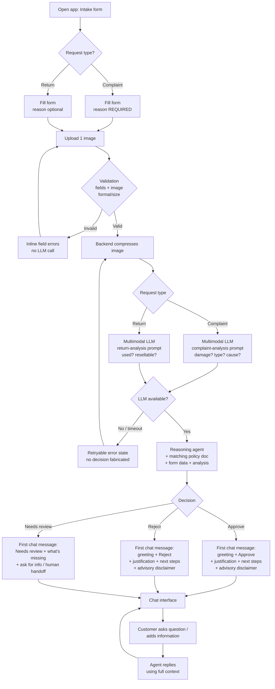

# PRD — Hardware Service Decision Copilot

> Status: **MVP / PoC** · Audience: developer agents creating the ADR and implementation.
> Scope of this document: functionality, system behavior, UX, and UI. Architecture and
> technology choices are deferred to the ADR.

---

## 1. Executive Summary

Hardware Service Decision Copilot is a web application that helps a customer decide whether
their electronics **complaint** (*reklamacja*) or **return** (*zwrot*) is likely to be
accepted. The customer fills a short form and uploads one photo of the equipment; a
multimodal LLM analyses the photo, and a reasoning agent combines that analysis with the form
data and the company's return/complaint policies to produce an **advisory** decision
(Approve / Reject / Needs review) with a clear justification. The customer then continues in a
chat interface to ask questions or provide additional information. This is an MVP: it produces
recommendations only — it does not make binding decisions.

---

## 2. Problem Statement

When a customer wants to return a product or file a complaint about electronics, they
typically do not know whether their case qualifies. The rules differ between returns
(distance-sale 14-day withdrawal, product must be unused and resellable) and complaints
(2-year statutory warranty / manufacturer guarantee, only genuine defects are covered, not
user-inflicted damage). Today the customer must read dense policy documents or contact support
and wait, and support staff must manually inspect photos and cross-reference policies for every
case. This is slow, inconsistent, and gives the customer no immediate, explained answer.

---

## 3. Users / Personas

### Persona A — Anna, online shopper (Return)
Bought a laptop online 5 days ago, changed her mind, the device looks unused. She wants to
know **right now** whether she can return it and what to do next, without reading the full
return policy. She expects a clear yes/no with reasons and concrete next steps.

### Persona B — Marek, owner of a faulty device (Complaint)
His 8-month-old smartphone stopped charging. He is unsure whether this counts as a covered
defect or whether he will be told "it's your fault". He wants to understand whether his
complaint has grounds, what evidence matters, and how to proceed.

### Persona C — Katarzyna, uncertain edge case
Her tablet has a small scratch and she wants to return it. Her case is genuinely ambiguous.
She expects the system to be honest that it cannot decide automatically, tell her what is
missing, and route her toward a human staff member rather than guessing.

---

## 4. Main Flows

### 4.1 Happy path — Return, Approve
1. Customer opens the app and lands on the intake form.
2. Customer selects **Return**, picks an equipment category, types the model name, sets the
   purchase date, optionally describes the reason, and uploads one photo. (Reason is optional
   for returns.)
3. Customer submits. The system validates all required fields and the image (format, size).
4. The system compresses the image and sends it to the multimodal LLM using the
   **return-analysis** prompt (judge whether the item shows no signs of usage and is resellable).
5. The system passes the image analysis + form data + return policy to the reasoning agent
   using the **return-decision** prompt.
6. The agent returns decision **Approve** with justification (within 14 days, no signs of use,
   resellable) and next steps.
7. The system transitions to the chat interface and renders the decision as the first system
   message (greeting + decision + explanation + next steps).
8. Customer may continue chatting (e.g. "How do I package it?"). The agent answers using the
   full conversation context.

### 4.2 Happy path — Complaint, Reject
1. Customer selects **Complaint**, fills the form. Reason description is **required**.
2. Customer uploads a photo showing a cracked screen.
3. The system compresses and sends the image to the multimodal LLM using the
   **complaint-analysis** prompt (judge whether damaged, what type, likely cause).
4. The agent receives "mechanical damage consistent with a drop" + form data + complaint policy
   via the **complaint-decision** prompt.
5. The agent returns decision **Reject** with justification (mechanical/user-inflicted damage is
   not covered by warranty) and next steps (e.g. paid repair option).
6. Decision is shown as the first chat message; customer can ask follow-up questions.

### 4.3 Alternative — Needs review (ambiguous)
1. Customer submits a blurry photo, or data is inconsistent (e.g. purchase date missing context,
   damage type unclear).
2. The agent cannot reach a confident Approve/Reject.
3. The agent returns **Needs review**, explains specifically what is missing or unclear, and
   asks the customer — in the first chat message — to provide the missing information or a
   clearer photo, and/or states that a human staff member will make the final decision.
4. Customer provides clarification in chat; the agent refines its explanation but the outcome
   remains advisory and may stay "Needs review".

### 4.4 Error — invalid submission
1. Customer submits with a missing required field, an unsupported image format, or an oversized
   image.
2. The system blocks submission and shows an inline, field-level error message; no LLM call is
   made.

### 4.5 Error — AI service unavailable
1. The image analysis or agent call fails or times out.
2. The system shows a non-technical error state with a retry option; no decision is fabricated.

---

## 5. User Stories

1. **(Happy path — return)** As an online shopper, I want to submit my product details and a
   photo and immediately receive an explained recommendation, so that I know whether to start a
   return without reading the full policy.
2. **(Happy path — complaint)** As an owner of a faulty device, I want the system to assess my
   photo and describe whether the damage looks like a covered defect, so that I understand
   whether my complaint has grounds.
3. **(Follow-up chat)** As a customer who received a decision, I want to ask follow-up questions
   and add information in chat, so that I can clarify my case without re-submitting the form.
4. **(Ambiguous result)** As a customer with an edge case, I want the system to tell me honestly
   when it cannot decide and what it needs, so that I am routed to a human instead of getting a
   wrong automatic answer.
5. **(Invalid input)** As a customer, I want clear inline errors when my form or image is
   invalid, so that I can fix the problem before submitting.
6. **(Service failure)** As a customer, I want a clear, retryable message when the AI is
   temporarily unavailable, so that I am not left with a broken screen or a fake decision.
7. **(Transparency)** As a customer, I want every decision to state that it is an advisory
   recommendation and not the final company decision, so that I have correct expectations.

---

## 6. Acceptance Criteria

### Form
- **AC-01** The form presents a request-type selector with exactly two options: **Complaint
  (Reklamacja)** and **Return (Zwrot)**.
- **AC-02** The form presents an equipment-category selector populated from a predefined list
  (see §8 Functional).
- **AC-03** The form provides a free-text input for equipment name/model.
- **AC-04** The form provides a date picker for date of purchase; a future date is rejected with
  an inline error.
- **AC-05** The reason field is a textarea; it is **required when request type = Complaint** and
  **optional when request type = Return**. Submitting a complaint with an empty reason is blocked
  with an inline error.
- **AC-06** Exactly one image upload is required; submission is blocked with an inline error if no
  image is provided.
- **AC-07** The image upload accepts only `JPEG`, `PNG`, and `WebP`. Any other type is rejected
  with an inline error naming the accepted formats.
- **AC-08** An image larger than 10 MB is rejected before upload/analysis with an inline error
  stating the 10 MB limit.
- **AC-09** No LLM call is made until all required fields and the image pass validation.

### Image Analysis
- **AC-10** Before being sent to the multimodal LLM, the image is compressed by the backend.
- **AC-11** For **Return**, the multimodal analysis evaluates whether the item shows no signs of
  usage and is resellable.
- **AC-12** For **Complaint**, the multimodal analysis evaluates whether the item is damaged, the
  damage type, and the likely cause.
- **AC-13** The multimodal prompt used differs based on the request type (return vs complaint).

### AI Decision
- **AC-14** The agent returns exactly one of three outcomes: **Approve**, **Reject**, or
  **Needs review**.
- **AC-15** The decision logic uses the request-type-specific decision prompt and injects the
  matching policy document (return policy for returns, complaint policy for complaints).
- **AC-16** Every decision includes a justification that references the concrete factors used
  (e.g. time since purchase, image findings, applicable policy rule).
- **AC-17** When the image is unusable or data is insufficient/conflicting, the agent returns
  **Needs review** and states specifically what additional information or better photo is needed.
- **AC-18** Every decision output includes an explicit advisory disclaimer that it is a
  recommendation, not the final/binding company decision.
- **AC-19** The agent never states a binding legal guarantee of outcome; it expresses likelihood
  and references policy.

### Chat
- **AC-20** After a successful decision, the app transitions to a chat interface where the first
  message is a system/agent message containing: greeting, decision, explanation, and next steps,
  rendered with formatting (headings/lists/emphasis as appropriate).
- **AC-21** The customer can send follow-up messages and receive responses.
- **AC-22** The agent has access to the full context in every chat turn: the form data, the image
  analysis description, and the first decision message.
- **AC-23** When the customer adds new information in chat, the agent incorporates it into its
  response.
- **AC-24** While the agent is generating a response, a visible in-progress indicator is shown.

### General
- **AC-25** All user-facing text is in Polish.
- **AC-26** On any LLM/backend failure, the user sees a non-technical, retryable error state and
  no fabricated decision is shown.
- **AC-27** The agent stays on-topic; off-topic requests are politely declined with a redirect to
  the complaint/return purpose of the assistant.

---

## 7. Out of Scope

**Authentication & accounts** — no login, user accounts, or roles in the MVP. The app is an
anonymous single-session tool.

**Session & decision persistence** — sessions, decisions, and actions are **not** saved to a
database in the MVP (deferred feature).

**Customer & purchase-history lookup** — retrieving existing customer data or purchase history
from a database is **not** in the MVP (deferred feature).

**RAG knowledge base** — an internal retrieval knowledge base about electronics specs and
procedures is **not** in the MVP (deferred feature). Policy is injected directly as static
documents instead.

**Binding decisions / case management** — the system produces advisory recommendations only;
it does not open, track, or resolve official complaint/return cases.

**Multiple images / video / attachments** — exactly one image per submission; no documents
(receipts, warranty cards) upload in the MVP.

**Multilingual support** — Polish only.

**Admin / staff UI** — no back-office, dashboard, queue, or human-handoff routing system.

**Notifications & email** — no email, SMS, or push notifications.

**Payments, shipping labels, RMA generation** — not handled.

**Mobile native apps** — responsive web only; no iOS/Android apps.

**Editing policy documents in-app** — policies are static files maintained outside the UI.

---

## 8. Constraints

### Business
- The system gives **advisory recommendations only**; a human always makes the final decision.
  Every decision must carry an advisory disclaimer (AC-18).
- Decisions and example policy documents are anchored to **Polish consumer law**: 14-day
  withdrawal right for distance sales (*zwrot*) and 2-year *rękojmia* / manufacturer *gwarancja*
  for complaints (*reklamacja*), expressed through the company policy documents in §8 references.
- The assistant must not promise a guaranteed outcome or give formal legal advice.

### Functional
- **Request types:** exactly two — Complaint (*Reklamacja*), Return (*Zwrot*).
- **Equipment categories (predefined list):** Smartfony, Laptopy, Tablety, Telewizory,
  Słuchawki, Smartwatche, Konsole do gier, Sprzęt audio, Aparaty fotograficzne, Akcesoria, Inne.
- **Image:** exactly 1 file; accepted formats `JPEG`, `PNG`, `WebP`; max **10 MB**; compressed by
  the backend before analysis.
- **Reason field:** required for Complaint, optional for Return.
- **Purchase date:** must not be in the future.
- **Language:** all user-facing text in Polish.
- **Platform:** responsive web (current evergreen desktop and mobile browsers).
- **Decision outcomes:** Approve, Reject, Needs review (three values only).

### External document / data references

| Document | File path | When it is used |
|---|---|---|
| Return policy (Polityka Zwrotów) | `docs/company-policies/polityka-zwrotow.md` | Injected into the agent context for **Return** decisions |
| Complaint policy (Polityka Reklamacji) | `docs/company-policies/polityka-reklamacji.md` | Injected into the agent context for **Complaint** decisions |

---

## 9. UI Description (wireframe level)

### 9.1 Intake Form screen
**Layout (top to bottom):**
- Title and one-line description of the tool's purpose.
- **Request type** — selector with two choices (Complaint / Return).
- **Equipment category** — dropdown from the predefined list.
- **Equipment name / model** — single-line text input.
- **Date of purchase** — date picker (future dates disabled/rejected).
- **Reason** — textarea. A visual "required" marker appears when Complaint is selected and a
  visual "optional" marker when Return is selected; the requirement updates when the request type
  changes.
- **Photo upload** — single-file picker/drop area showing accepted formats and the 10 MB limit,
  with a thumbnail preview after selection and a way to remove/replace the image.
- **Submit** button.

**Interactive behavior:**
- Changing the request type updates the reason field's required/optional state.
- Each interactive element shows inline, field-level validation messages.

**Error states:** missing required field, future purchase date, unsupported image format,
oversized image — each shown inline next to the relevant field; submit is disabled or blocked
until resolved.

**Empty state:** clean form with placeholders/help text; no errors shown before first
interaction or submit attempt.

**Loading state:** after a valid submit, the submit control shows an in-progress state and the
form is locked while the image is analysed and the decision is generated (analysis can take
several seconds).

**Navigation:** on a successful decision, the app advances from the form to the chat screen.

### 9.2 Chat screen
**Layout:**
- Conversation area with message bubbles distinguishing system/agent messages from the
  customer's messages.
- **First message** is an agent bubble containing the formatted decision: greeting, the decision
  outcome (clearly labelled Approve / Reject / Needs review), explanation/justification, next
  steps, and the advisory disclaimer.
- A compact, read-only summary of the submitted case (request type, category, model, purchase
  date) is available for context (e.g. header or collapsible panel).
- Message input field with a send control at the bottom.

**Interactive behavior:**
- Customer types a message and sends it; the agent replies using full conversation context.
- An in-progress indicator is shown while the agent generates a reply.

**Error states:** if an agent reply fails, an inline error with a retry option appears for that
turn; prior messages remain intact.

**Empty state:** not applicable — the chat always opens with the decision message present.

**Navigation:** the chat is the terminal screen of the MVP flow; optionally a control to start a
new case returns to a fresh form (no data carried over).

---

## 10. User Flow Diagram



---

## 11. Agent / System Behavior Specification

### 11.1 Role and purpose
There are two cooperating AI roles:
- **Image analyst (multimodal LLM):** produces a structured textual description of the uploaded
  photo. Two distinct prompts:
  - *Return-analysis:* judge whether the item shows no signs of usage and could be resold as new.
  - *Complaint-analysis:* judge whether the item is damaged, the damage type, and the most likely
    cause (manufacturing defect vs user-inflicted/external).
- **Decision agent (reasoning LLM):** takes the image analysis + form data + the matching policy
  document and produces the advisory decision and justification. Two distinct prompts (return vs
  complaint). It also handles all subsequent chat turns with full context.

### 11.2 Allowed
- Recommend one of: Approve, Reject, Needs review, with a justification grounded in the injected
  policy and the image analysis.
- Ask the customer for clarifying information or a better photo (especially for Needs review).
- Explain policy rules and next steps in plain Polish.
- Incorporate new information the customer provides in chat.

### 11.3 Not allowed
- Must not present its output as a final or binding company decision.
- Must not promise or guarantee a specific outcome, refund, or repair.
- Must not give formal legal advice or cite obligations beyond the provided policy documents.
- Must not invent policy rules, prices, deadlines, or facts not present in the form, image
  analysis, or policy documents.
- Must not request or store sensitive personal data (e.g. full payment card numbers, government
  IDs); it only needs the case details already in the form.
- Must not fabricate a decision when the LLM service fails — the system surfaces an error instead.

### 11.4 Decision categories and communication
- **Approve** — case appears to meet the policy. Communicate the qualifying factors and the next
  steps to proceed.
- **Reject** — case appears not to meet the policy. Communicate the specific disqualifying factor
  (e.g. mechanical damage, exceeded window) and any alternative (e.g. paid repair).
- **Needs review** — cannot decide confidently. State exactly what is missing/ambiguous, ask for
  it, and indicate that a human staff member will make the final call.

### 11.5 Mandatory disclaimer
Every decision message must include a clear statement (in Polish) that the result is an advisory
recommendation generated by an AI assistant and is **not** the final/binding decision of the
company; a human staff member makes the final determination.

### 11.6 Off-topic / out-of-scope handling
If the customer asks something unrelated to their complaint/return (general chit-chat, unrelated
products, legal advice beyond policy), the agent politely declines and redirects to the purpose
of the assistant.

### 11.7 Language and tone
- All agent output in **Polish**.
- Tone: clear, empathetic, professional, non-bureaucratic. Plain language over legalese.
- Decision message is nicely formatted (greeting, clearly labelled decision, explanation, next
  steps, disclaimer).

---

## 12. Further Notes

**Assumptions made**
- The primary user is the **end customer (self-service)**, despite the product name referencing
  service employees; tone and UX target customers.
- Decisions are **advisory only**; no human-in-the-loop routing system exists in the MVP (a human
  handoff is communicated as text, not implemented as a workflow).
- The two policy documents are **examples** created to bootstrap the MVP
  (`docs/company-policies/`) and are expected to be reviewed/replaced by the legal team.
- Sales channel (online vs in-store) affects the return window; since the form does not capture
  channel explicitly, the agent should treat channel as a clarifying factor and may route to
  **Needs review** when it materially affects the outcome. *(Open question — see below.)*

**Open questions / deferred decisions**
- Should the form capture the **sales channel** (online vs in-store) to apply the 14-day vs
  30-day window precisely? Deferred; currently handled via Needs review.
- Decision-confidence display (showing a confidence level to the user) — deferred.
- Persistence, customer/purchase-history lookup, and RAG — deferred features (see §7), to be
  designed in a later iteration and covered by future PRD/ADR updates.
- Exact prompt texts for the four prompts (return-analysis, complaint-analysis, return-decision,
  complaint-decision) are an implementation concern for the ADR; this PRD specifies their
  required behavior only.
```
